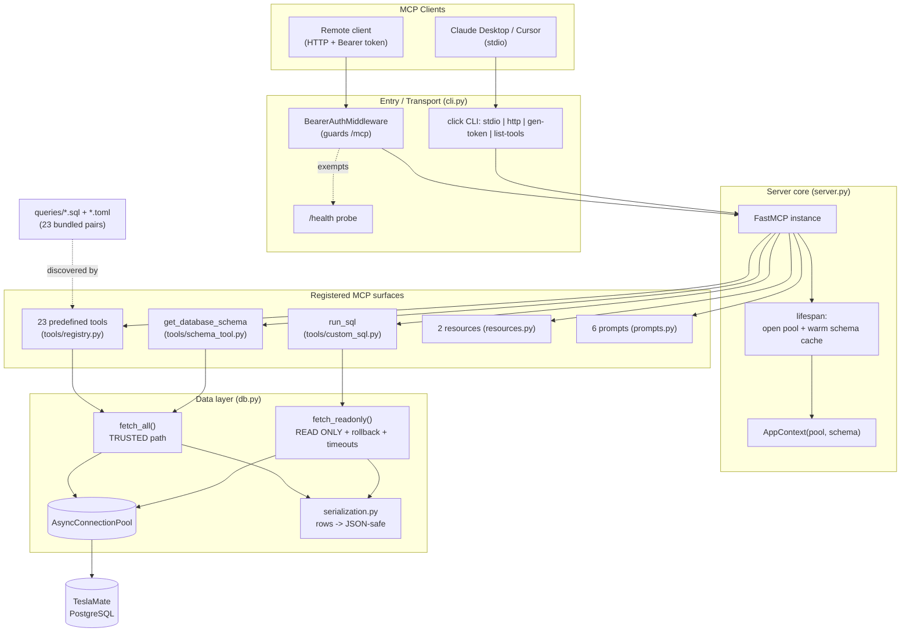

# Codebase Map

> Auto-generated by Cartographer. Last mapped: 2026-07-03

**teslamate-mcp** is a [Model Context Protocol](https://modelcontextprotocol.io) server that exposes a
[TeslaMate](https://github.com/teslamate-org/teslamate) PostgreSQL database to AI assistants (Claude Desktop,
Cursor, etc.) over **stdio** and **streamable HTTP**. It surfaces **25 tools** (23 predefined analytics/search queries with
typed optional parameters + `run_sql` + `get_database_schema`), **6 prompts**, and **2 resources**. Python 3.11+, built on the official
`mcp[cli]` SDK (FastMCP) and `psycopg` 3 async pool.

---

## System Overview



**Core principle: two trust levels.** Bundled `.sql` files are *trusted* and run through the fast, unguarded
`fetch_all()`. Arbitrary LLM-supplied SQL (`run_sql`) is *untrusted* and runs through `fetch_readonly()`, whose
Postgres `READ ONLY` + forced-rollback transaction is the real security boundary (regex validation is only a
cheap first line of defense).

---

## Directory Structure

```
teslamate-mcp/
├── src/teslamate_mcp/
│   ├── __init__.py          # __version__ from installed distribution metadata
│   ├── __main__.py          # `python -m teslamate_mcp` shim -> cli.main
│   ├── cli.py               # click CLI + HTTP app wiring + /health  ← PROCESS ENTRY
│   ├── server.py            # create_server(): FastMCP factory + lifespan
│   ├── config.py            # pydantic-settings Settings (env / .env)
│   ├── db.py                # pool + fetch_all (trusted) / fetch_readonly (guarded)
│   ├── auth.py              # BearerAuthMiddleware (timing-safe, guards /mcp)
│   ├── serialization.py     # psycopg row values -> JSON-safe primitives
│   ├── schema.py            # information_schema introspection
│   ├── resources.py         # 2 MCP resources (query index / SQL by URI)
│   ├── prompts.py           # 6 canned multi-step prompt templates
│   ├── tools/
│   │   ├── __init__.py      # facade re-exporting the registration API
│   │   ├── registry.py      # .sql+.toml -> MCP tool discovery & registration
│   │   ├── custom_sql.py    # run_sql tool: validate_sql + enforce_limit
│   │   └── schema_tool.py   # get_database_schema tool
│   └── queries/             # 23 × (<name>.sql + <name>.toml) bundled report pairs
├── tests/                   # pytest + pytest-asyncio + testcontainers[postgres]
├── pyproject.toml           # hatchling build, deps, ruff/pytest config, console script
├── Dockerfile               # multi-stage (uv builder -> slim runtime, non-root, /health)
├── docker-compose.yml       # single service, port 8888, env passthrough
├── .github/workflows/       # ci.yml (lint+test matrix+docker smoke), release.yml (GHCR)
├── env.example              # all Settings env vars documented
└── README / CONTRIBUTING / SECURITY / CHANGELOG
```

---

## Module Guide

### Entry & Transport — `cli.py`

**Purpose**: The actual process entry point (`teslamate-mcp` console script / `python -m teslamate_mcp`).
**Entry point**: `main` (click group).

| Subcommand | What it does |
|------------|--------------|
| `stdio` | `create_server()` → `mcp.run(transport="stdio")` — local, no auth (process boundary). |
| `http [--host --port --auth-token --json-response/--sse-response]` | Builds `mcp.streamable_http_app()`, appends `/health`, conditionally wraps `BearerAuthMiddleware`, serves via `uvicorn.run`. |
| `gen-token [--length 32]` | Prints `AUTH_TOKEN=<secrets.token_urlsafe(length)>`. `--length` is **byte** length. |
| `list-tools` | Enumerates predefined tool names + source files (+ the 2 built-ins) **without booting the server** — used by CI smoke test. |

**Gotchas**:
- ⚠️ **If `AUTH_TOKEN` is unset, the HTTP endpoint runs fully unauthenticated** — only a warning is logged; the server does not refuse to start.
- `--auth-token` also reads `envvar="AUTH_TOKEN"` directly (separate from pydantic-settings). The click option overwrites `settings.auth_token` after `load_settings()`, so it wins.
- `--json-response` sets `mcp.settings.json_response` — must happen **before** `streamable_http_app()`, which lazily builds the session manager and reads the flag at construction time. (Was previously a nonexistent field set after app creation → startup crash; fixed post-0.3.1.)

### Server core — `server.py`

**Purpose**: Shared bootstrap for both transports.
**Key export**: `create_server(settings: Settings) -> FastMCP`; `AppContext` dataclass (`pool`, `schema`).
**Pattern**: `@asynccontextmanager` **lifespan** opens the pool, **pre-loads the full DB schema once at startup**
(cached on `AppContext.schema`), yields `AppContext`, closes the pool on shutdown. `AppContext` is reachable in
every handler via `ctx.request_context.lifespan_context`.
**Registration order**: predefined tools → schema tool → custom SQL tool → resources → prompts.
**Gotcha**: host/port/debug are baked into the FastMCP instance even for `stdio`, where they are unused.

### Config — `config.py`

**Purpose**: `pydantic-settings` config from env vars / `.env` (`case_sensitive=False`, `extra="ignore"`).

| Field | Env var | Default | Notes |
|-------|---------|---------|-------|
| `database_url` | `DATABASE_URL` | **required** | Postgres DSN; missing → `ValidationError` at startup (fail-fast) |
| `auth_token` | `AUTH_TOKEN` | `None` (`SecretStr`) | empty disables HTTP auth |
| `host` / `port` | `HOST` / `PORT` | `0.0.0.0` / `8888` | port `1..65535` |
| `pool_min_size` / `pool_max_size` | `POOL_MIN_SIZE` / `POOL_MAX_SIZE` | `1` / `10` | |
| `query_timeout_ms` | `QUERY_TIMEOUT_MS` | `5000` | `statement_timeout` for `run_sql` only |
| `custom_sql_row_limit` | `CUSTOM_SQL_ROW_LIMIT` | `1000` | auto-`LIMIT` for `run_sql` |
| `report_timezone` | `REPORT_TIMEZONE` | `UTC` | IANA name; binds to the reserved `%(tz)s` placeholder |
| `log_level` | `LOG_LEVEL` | `INFO` | |
| `debug` | `DEBUG` | `False` | Starlette debug |

### Data layer — `db.py` + `serialization.py` + `schema.py`

**`build_pool(settings)`** → `AsyncConnectionPool(open=False, row_factory=dict_row)`; opened/closed by the lifespan.

Two execution paths mapped to two trust levels:
- **`fetch_all(pool, query, params=None)`** — TRUSTED. Bare `execute`/`fetchall`. No read-only wrapper, no timeout.
  Used by predefined tools + schema query. **Must never receive user SQL.**
- **`fetch_readonly(pool, query, statement_timeout_ms)`** — UNTRUSTED. `set_autocommit(False)` →
  `transaction(force_rollback=True)` → `SET TRANSACTION READ ONLY` → `SET LOCAL statement_timeout` +
  `lock_timeout=2000` (hardcoded) + `idle_in_transaction_session_timeout`. **Always rolled back**, even on
  success. `SET LOCAL` values are built with `psycopg.sql.Literal` (can't bind params); an `int()` cast guards
  injection. This is the real safety boundary for `run_sql`.

Both paths funnel results through **`serialization.rows_to_jsonable`** → `to_jsonable`: `Decimal→float`
(deliberate precision-loss tradeoff for LLM math), `datetime/date/time→isoformat`, `timedelta→total_seconds`,
`UUID→str`, `bytes→.hex()`, recursive dict/list, `str()` catch-all fallback.

**`schema.load_schema(pool)`** queries `information_schema.columns` (excluding `pg_catalog`/`information_schema`/`pg_%`)
via the trusted `fetch_all` path; one row per column.

### Tool registry — `tools/registry.py` (the core mechanism)

Turns declarative **`<name>.sql` + `<name>.toml`** file pairs into MCP tools:
1. `_queries_dir()` resolves the bundled dir via `importlib.resources.files("teslamate_mcp").joinpath("queries")` —
   works from source **and** installed wheel (why `pyproject.toml` has a hatch `force-include` for `queries/`).
2. `discover_predefined_tools()` globs `*.sql`, requires a sibling `.toml` (missing → `FileNotFoundError`) with
   `name` + `description` keys (missing → `ValueError`). **Fail-fast at startup**, not silent skip.
3. `register_predefined_tools()` → `_register_one()` builds one `async def handler(ctx)` **per tool via a factory**
   (avoids the late-binding closure bug), pulls the pool from lifespan context, logs via `ctx.info()`, calls
   `fetch_all(pool, tool.sql)`. All share `ToolAnnotations(readOnlyHint=True, idempotentHint=True, ...)`.

Params: the `.toml` contract supports `[[params]]` tables (name/type/description/required/default/min/max/enum),
validated at discovery with SQL-placeholder cross-checks and a stray-`%` lint. `_build_signature()` crafts a real
`inspect.Signature` (ctx first, `Annotated[T, Field(...)]` annotations, defaults on the Parameter) and sets it as
`handler.__signature__` — the single source of truth FastMCP introspects for the input schema. Values bind via
psycopg `%(name)s` placeholders (dict params); the reserved `%(tz)s` placeholder auto-injects `REPORT_TIMEZONE`.

**Historical gotcha (fixed in 0.4.0)**: predefined tools took no parameters (no per-car or
per-date filtering). `handler.__annotations__["ctx"] = Context` is patched manually — see the 0.3.1 bugfix below.

### Custom SQL — `tools/custom_sql.py` (`run_sql`)

The escape hatch for arbitrary read-only SQL. Two independent layers:
1. **`validate_sql(sql)`** (cheap Python pre-check, *not* the real boundary): strips comments + blanks string
   literals (`_strip_safe`), rejects multi-statement (stray `;`), requires leading `SELECT`/`WITH`, blocks a
   `_FORBIDDEN_KEYWORDS` regex (INSERT/UPDATE/DELETE/DROP/CREATE/ALTER/TRUNCATE/GRANT/REVOKE/COPY/VACUUM/… ).
2. **`enforce_limit(sql, default_limit)`**: if no `LIMIT`, wraps as `SELECT * FROM (<body>) AS _capped LIMIT N`
   (preserves inner `ORDER BY`/CTE semantics).
3. Executes via **`fetch_readonly`** — the actual guarantee. Postgres itself refuses writes in READ ONLY mode, so
   anything slipping past the regex still cannot mutate data.

`register_custom_sql(mcp, *, statement_timeout_ms, row_limit)` closes those `Settings` values into the handler.

### Schema tool — `tools/schema_tool.py` (`get_database_schema`)

Returns the cached schema from lifespan context; re-loads + re-caches only if `None`.
**Gotcha**: cache is warmed once at startup and **never invalidated** on a running server — live DDL changes are
picked up only on restart.

### Resources — `resources.py`

Two static MCP **resources** derived from the `PredefinedTool` list:
- `teslamate://queries` — JSON index `{name, description, source}` per tool.
- `teslamate://queries/{name}` — raw SQL text for a named query (URI-template routing; `ValueError` on unknown).
**Why resources, not tools**: FastMCP resource handlers cannot receive a `Context`, so they're limited to static,
pre-computed content (no live DB access).

### Prompts — `prompts.py`

Six canned `@mcp.prompt` templates returning numbered instruction strings that name specific tools to call:
`analyze_battery_health`, `summarize_driving(window="last 30 days")`, `analyze_charging`, `find_anomalies`,
`weather_efficiency`, `status_report`.
**Gotcha**: prompts hardcode tool names as strings — renaming a query's `.toml` `name` silently breaks the
reference (no cross-check).

---

## The Query Catalog (23 predefined tools)

Since 0.4.0 every tool accepts **typed optional params** — `car_name` everywhere, plus `days`/`limit`/thresholds
where applicable (zero-arg calls preserve the classic full report). The `.toml` contract is `name` + `description`
+ optional `[[params]]` tables. Tool name is taken from the `.toml`, not the filename.

| Tool (`name` in .toml) | Purpose | TeslaMate tables |
|------------------------|---------|------------------|
| `get_basic_car_information` | Vehicle identity/config (model, trim, color, flags) | `cars`, `car_settings` |
| `get_current_car_status` | Latest snapshot + nearest known address (Euclidean lat/long) | `positions`, `cars`, `addresses` |
| `get_software_update_history` | Firmware update log w/ computed duration | `updates`, `cars` |
| `get_battery_health_summary` | Latest battery stats + health% (rated÷ideal range) | `positions`, `cars` |
| `get_battery_degradation_over_time` | Monthly rated range at 100% charge, last 24 mo | `positions`, `cars` |
| `get_daily_battery_usage_patterns` | Daily battery swing (>5%), last 30 days | `positions`, `cars` |
| `get_tire_pressure_weekly_trends` | Weekly TPMS avg per wheel, last 90 days | `positions`, `cars` |
| `get_monthly_driving_summary` | Monthly per-car trip/distance/speed/temp | `drives`, `cars` |
| `get_daily_driving_patterns` | Trip stats by day-of-week | `drives`, `cars` |
| `get_longest_drives_by_distance` | Top-10 longest drives + addresses | `drives`, `cars`, `addresses` |
| `get_total_distance_and_efficiency` | Lifetime per-car totals | `drives`, `cars` |
| `get_drive_summary_per_day` | Daily fleet totals (**all cars combined**) | `drives` |
| `get_efficiency_by_month_and_temperature` | Monthly temp/distance (only CTE-based query) | `drives`, `cars` |
| `get_average_efficiency_by_temperature` | Range-consumption % across 5 temp bands | `drives`, `cars` |
| `get_unusual_power_consumption` | Top-10 drives w/ >150% range-consumption anomaly | `drives`, `cars`, `addresses` |
| `get_charging_by_location` | Charging stats per address (**all cars combined**) | `charging_processes`, `addresses` |
| `get_all_charging_sessions_summary` | Per-car charging totals + cost | `charging_processes`, `cars` |
| `get_most_visited_locations` | Top-15 addresses by visit count (**all cars combined**) | `drives`, `addresses` |

| `search_drives` | Drive search: date range, location text, distance bounds, sort | `drives`, `cars`, `addresses` |
| `search_charging_sessions` | Charging-session search: date range, location, min energy | `charging_processes`, `cars`, `addresses` |
| `get_drive_details` | Full stats for one drive (**drive_id required**) | `drives`, `cars`, `addresses` |
| `get_charging_curve` | NTILE-downsampled power/SOC curve for one session (**charging_process_id required**) | `charges` |
| `get_charging_costs` | Cost totals grouped by month/location/car | `charging_processes`, `cars`, `addresses` |

**Plus 2 built-ins**: `get_database_schema(table=None)` and `run_sql(query)` = **25 tools total**.

### Inferred TeslaMate schema

`cars` is the hub (`id`); `positions` (dense telemetry: battery, range, odometer, temp, lat/long, TPMS),
`drives` (per-trip aggregates w/ `start_address_id`/`end_address_id`), `charging_processes` (per-session,
`address_id`, `cost`), `updates` (firmware) all FK via `car_id`. `addresses` is the reverse-geocoded location
dimension. `car_settings` joins 1:1 via `cars.settings_id`.

### SQL conventions & gotchas
- **Metric-only** (`_km`, °C) — no mile/°F conversion; consumers infer units from column names.
- **Timezones**: day/week/month buckets follow `REPORT_TIMEZONE` (via `AT TIME ZONE %(tz)s`); rolling `days`
  windows stay `CURRENT_DATE`-based (sargable, deliberately tz-approximate).
- **3 queries drop the per-car join** (`drive_summary_per_day`, `charging_by_location`, `most_visited_locations`)
  → fleet totals, though their `.toml` descriptions say "each car" (boilerplate mismatch).
- "Battery health %" and ">150% consumption" are **rated-range heuristics**, not calibrated energy/capacity metrics.
- Nearest-address in `current_car_status` is naive Euclidean (no distance cap) — always returns *some* address.
- Repeated "latest row per car" correlated-subquery idiom; hardcoded `LIMIT` on top-N reports.

---

## Data Flow

```mermaid
sequenceDiagram
    participant Client as MCP Client
    participant FastMCP
    participant Handler as Tool handler
    participant DB as db.py
    participant PG as PostgreSQL

    Note over Client,PG: Predefined tool (e.g. get_battery_health_summary)
    Client->>FastMCP: call tool (Context injected)
    FastMCP->>Handler: handler(ctx)
    Handler->>Handler: pool = ctx...lifespan_context.pool
    Handler->>DB: fetch_all(pool, tool.sql)
    DB->>PG: execute static SQL
    PG-->>DB: rows (dict_row)
    DB->>DB: rows_to_jsonable(rows)
    DB-->>Handler: JSON-safe list[dict]
    Handler-->>Client: result

    Note over Client,PG: run_sql (untrusted)
    Client->>FastMCP: run_sql(query="SELECT ...")
    FastMCP->>Handler: handler(ctx, query)
    Handler->>Handler: validate_sql(query)  [reject on fail]
    Handler->>Handler: enforce_limit(query, row_limit)
    Handler->>DB: fetch_readonly(pool, capped, timeout)
    DB->>PG: BEGIN; SET READ ONLY; SET LOCAL timeouts
    DB->>PG: execute query
    PG-->>DB: rows
    DB->>PG: ROLLBACK (force_rollback=True)
    DB->>DB: rows_to_jsonable(rows)
    DB-->>Handler: JSON-safe list[dict]
    Handler-->>Client: result
```

### HTTP auth flow (`auth.py`)
Only paths under `/mcp` are protected. `Authorization: Bearer <token>` is compared with `hmac.compare_digest`
(timing-safe). Missing/malformed → 401 + `WWW-Authenticate: Bearer`. `/health` is added *after* the middleware
wraps the app and doesn't start with `/mcp`, so it's exempt. Auth is **opt-in** — attached only if a non-empty
token is present.

---

## Build, Test & CI

**Packaging** (`pyproject.toml`): `teslamate-mcp` v0.3.1, Python ≥3.11, **hatchling** build (src-layout;
`force-include` bundles `queries/` into the wheel). Console script `teslamate-mcp = "teslamate_mcp.cli:main"`.
Runtime deps: `mcp[cli]`, `psycopg[binary]`, `psycopg-pool`, `pydantic`, `pydantic-settings`, `click`, `uvicorn`,
`starlette`. Dev: `ruff`, `pytest`, `pytest-asyncio`, `testcontainers[postgres]`. Ruff line-length 100.

**Tests** (`tests/`): pytest + `pytest-asyncio` (`asyncio_mode="auto"`) + **testcontainers** spinning a real
`postgres:16-alpine` (a session-scoped `conftest.py` seeds a `demo_cars` table). Docker-backed integration tests
(`test_db.py`, `test_schema.py`) **skip** when Docker is absent. Pure unit tests cover `serialization`,
`custom_sql` validators, and registry discovery. `test_registry.py` includes a regression test that `ctx` never
leaks into any tool's `inputSchema` (the 0.3.1 fix). **Untested**: `auth.py`, `cli.py`, `prompts.py`,
`resources.py`. Since 0.4.0, `tests/test_tools_e2e.py` runs **every** bundled query against a seeded
TeslaMate-shaped Postgres, plus param binding, timezone bucketing, and schema-tool tests;
`tests/test_registry_params.py` covers the TOML contract validation.

**Docker**: multi-stage — `uv sync --frozen --no-dev` in a builder, copied into a slim non-root (`mcp`, uid 1000)
runtime with only `libpq5`. `EXPOSE 8888`, `HEALTHCHECK` hits `/health`, `CMD` runs `http --json-response`.
`docker-compose.yml` maps `8888:8888` and passes `DATABASE_URL`/`AUTH_TOKEN`/`LOG_LEVEL`.

**CI/CD**:
- `ci.yml` (push/PR to `main`): `lint` (ruff format --check + check) → `test` (matrix 3.11/3.12/3.13, `pytest -ra`)
  → `docker` (build + `list-tools` smoke test).
- `release.yml` (tags `v*`): builds & pushes **multi-arch** (amd64+arm64) image to **GHCR**, creates a GitHub
  release with generated notes. **No PyPI publish** despite the full hatchling config.

---

## Conventions

- **Src-layout** package; fully type-annotated; ruff for lint *and* format (both gate CI).
- **Two trust levels** for DB access — never route user SQL through `fetch_all`.
- **Fail-fast startup**: missing `DATABASE_URL`, missing `.toml` sidecar, or missing `name`/`description` crashes
  the whole server at boot (not a silent per-tool skip).
- **Declarative tools**: add a query = drop a `.sql` + `.toml` pair; no code change.
- **Serialization is centralized** in `db.py` (callers never see raw psycopg types).
- Commits: one logical change each; conventions in `CONTRIBUTING.md`; security issues via `SECURITY.md` (private).

## Gotchas (top of mind)

1. **HTTP is unauthenticated unless `AUTH_TOKEN` is set** — only a warning, not a hard stop.
2. **Param SQL rules** — cast the first occurrence of every `%(param)s` (`::text`/`::int`/`::float8`), escape
   literal `%` as `%%` in parameterized queries, and repeat bucketing expressions identically in GROUP BY.
   Discovery lints these at startup.
3. **`fetch_all` has no read-only/timeout guard** — safe only because its SQL is curated. New predefined queries
   must be manually verified non-mutating.
4. **Schema cache never invalidates** on a live server — DDL changes need a restart.
5. **Metric-only + timezone-naive** query results.
6. **`fetch_readonly` is the real `run_sql` safety net** — the regex validator is defense-in-depth, not the guarantee.
7. `__version__` reads `0.0.0+unknown` if run from source without an (editable) install.

## Navigation Guide

- **Add a new report/tool** → create `src/teslamate_mcp/queries/<name>.sql` + `<name>.toml` (`name`,
  `description`). Auto-discovered on restart. Verify with `teslamate-mcp list-tools`. Optionally reference it in a
  prompt (`prompts.py`).
- **Change DB safety / add a new execution path** → `db.py` (`fetch_all` vs `fetch_readonly`).
- **Tighten `run_sql` validation** → `tools/custom_sql.py` (`validate_sql` / `_FORBIDDEN_KEYWORDS` / `enforce_limit`).
- **Modify HTTP auth** → `auth.py` (`BearerAuthMiddleware`) + wiring in `cli.py::http`.
- **Add/adjust a config option** → `config.py` (`Settings`) + document in `env.example` + README.
- **Change transport/entry behavior** → `cli.py`.
- **Change server bootstrap / registration order / lifespan** → `server.py`.
- **Add a JSON type conversion** → `serialization.py::to_jsonable`.
- **Add a prompt** → `prompts.py::register_prompts`. **Add a resource** → `resources.py::register_resources`.
```
